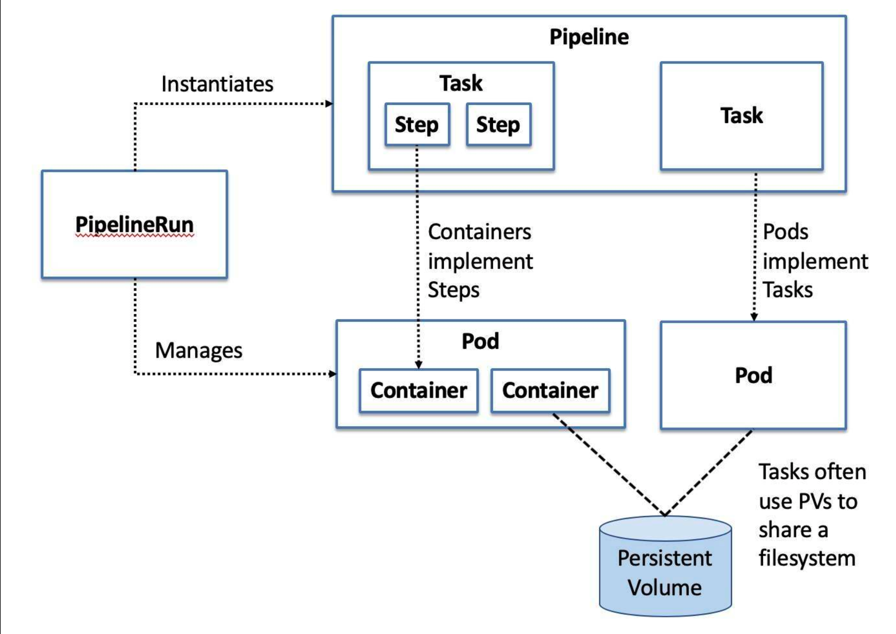
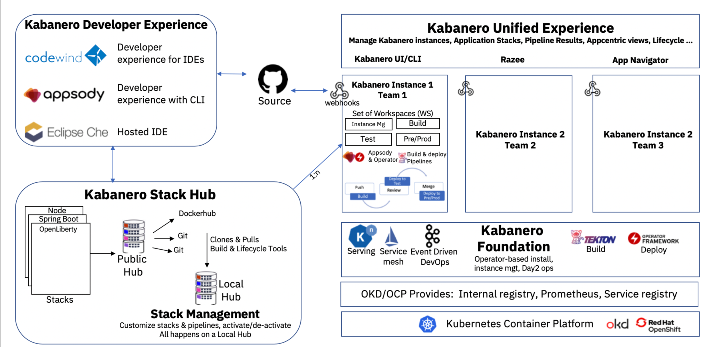

# Introduction
What is Tekton, Kabanero and Appsody?  You can think of Tekton as a very powerful but yet flexible open-source framework for creating continuous integration and delivery (CI/CD) systems.  It lets you build, test and deploy across multiple cloud providers such as the IBM Public Cloud, Private Cloud, AWS, Azure etc.  It achieves this by abstracting away the underlying implementation details.  Kabanero provides a set of pre-built pipelines and tasks. It delivers new and existing middleware tools to modernize your cloud journey.  Appsody includes a set of tools and capabilities you can use to build cloud native applications and custom stacks.


In a nutshell Tekton is composed of Pipelines, PipelineRuns, Tasks, TaskRuns, TriggerBindings, TriggerEvents, Fig 1. provides more detail. Fig 2 provides an architecture overview of Kabanero.


### Fig 1. Tekton Overview
 

### Fig 2. Kabanero Arch Overview
 


### Prereqs
Openshift ICP4A (Cloudpak for Apps) or a local instance of minikube with Kabanero 0.6.0 installed
Also you need Sonarqube installed on your cluster, will provide instructions later.


# How to integrate custom pipelines with Kabanero ~ 15 mins 
What if the default Kabanero pipelines are not enough? You've spent some time developing your own pipelines, but the pipelines Kabanero provide are yet simple but not enough. Perhaps you have some java code that must store jar binaries in Artifactory or you need to do code analysis? How do we go about creating a custom pipeline for specific requirements? 

 ```
 ~/Documents/gse-devops/github.com/pipelines ./run.sh
===========================================================================

======================== AUTOMATOR SCRIPT =================================

===========================================================================

🦄 Do you want to
    1) Set up environment, containerzied pipelines and release them to a registry?
    2) Add, commit and push your latest changes to github?
    3) Create a git release for your pipelines?
    4) Upload an asset to a git release version?
    5) Update the Kabanero CR custom resource with a release?
    6) Add a stable pipeline release version to the Kabanero custom resource?
    enter a number >

Here is a quick demo I made https://asciinema.org/a/315675
49
